

  

<h3 align="center">Blazor Express Bulma Component Library</h3>

  An Enterprise-class component library built with the Blazor and Bulma CSS frameworks.
   
  <a href="https://bulma.blazorexpress.com/docs/getting-started/"><strong>Getting Started »</strong></a>
   

## Status

## Docs & Demos

- [Docs Website](https://bulma.blazorexpress.com/docs/)
- [Demos Website](https://bulma.blazorexpress.com/demos/)

## Table of contents

- [Status](#status)
- [Docs & Demos](#docs--demos)
- [Install](#install)
- [Release 1.2.0](#release-120)
- [Versions](#versions)
- [Supported Versions](#supported-versions)
- [Components](#components)
- [Component Screenshots](#component-screenshots)
- [Copyright and license](#copyright-and-license)

## Install

Install with [NuGet](https://www.nuget.org/): `Install-Package BlazorExpress.Bulma -Version 1.2.0`

## Release 1.2.0

`1.2.0` adds Card, Menu, Panel, Spinner, SplitView, SelectInput, TextAreaInput, CheckboxInput, CheckboxListInput, RadioInput, RadioListInput, and chart components, along with PdfViewer password-flow improvements.

## Versions

| Package | Version | Notes |
|:--|:--|:--|
| `BlazorExpress.Bulma` | `1.2.0` | Primary UI component library package. |
| `BlazorExpress.Core` | `0.3.0` | Required dependency referenced by the library package. |
| `BlazorExpress.ChartJS` | `1.2.2` | Optional package used by the chart docs and demos. |

## Supported Versions

| Surface | Version |
|:--|:--|
| .NET targets | `net8.0`, `net9.0`, `net10.0` |
| Bulma | `1.0.4` |
| PDF.js | `4.0.379` |
| Bootstrap Icons | `1.11.3` |
| Google Font Icons | Included |
| Chart.js | `4.4.1` |
| `chartjs-plugin-datalabels` | `2.2.0` |

## Components

Browse the currently available components, organized by category, with direct links to the documentation and live demos. This section is intended to help evaluators and adopters quickly explore the library surface area.

| Category | Component Name | Docs | Demo |
|:--|:--|:--|:--|
| Features | Skeletons | [Docs](https://bulma.blazorexpress.com/docs/skeletons) | [Demos](https://bulma.blazorexpress.com/demos/skeletons) |
| Charts | Bar Chart | [Docs](https://bulma.blazorexpress.com/docs/bar-chart) | [Demos](https://bulma.blazorexpress.com/demos/bar-chart) |
| Charts | Bubble Chart | [Docs](https://bulma.blazorexpress.com/docs/bubble-chart) | [Demos](https://bulma.blazorexpress.com/demos/bubble-chart) |
| Charts | Doughnut Chart | [Docs](https://bulma.blazorexpress.com/docs/doughnut-chart) | [Demos](https://bulma.blazorexpress.com/demos/doughnut-chart) |
| Charts | Line Chart | [Docs](https://bulma.blazorexpress.com/docs/line-chart) | [Demos](https://bulma.blazorexpress.com/demos/line-chart) |
| Charts | Pie Chart | [Docs](https://bulma.blazorexpress.com/docs/pie-chart) | [Demos](https://bulma.blazorexpress.com/demos/pie-chart) |
| Charts | PolarArea Chart | [Docs](https://bulma.blazorexpress.com/docs/polar-area-chart) | [Demos](https://bulma.blazorexpress.com/demos/polar-area-chart) |
| Charts | Radar Chart | [Docs](https://bulma.blazorexpress.com/docs/radar-chart) | [Demos](https://bulma.blazorexpress.com/demos/radar-chart) |
| Charts | Scatter Chart | [Docs](https://bulma.blazorexpress.com/docs/scatter-chart) | [Demos](https://bulma.blazorexpress.com/demos/scatter-chart) |
| Icons | Bootstrap Icons | [Docs](https://bulma.blazorexpress.com/docs/icons/bootstrap-icons) | [Demos](https://bulma.blazorexpress.com/demos/icons/bootstrap-icons) |
| Icons | Google Font Icons | [Docs](https://bulma.blazorexpress.com/docs/icons/google-font-icons) | [Demos](https://bulma.blazorexpress.com/demos/icons/google-font-icons) |
| Elements | Block | [Docs](https://bulma.blazorexpress.com/docs/block) | [Demos](https://bulma.blazorexpress.com/demos/block) |
| Elements | Box | [Docs](https://bulma.blazorexpress.com/docs/box) | [Demos](https://bulma.blazorexpress.com/demos/box) |
| Elements | Button | [Docs](https://bulma.blazorexpress.com/docs/button) | [Demos](https://bulma.blazorexpress.com/demos/button) |
| Elements | Delete Button | [Docs](https://bulma.blazorexpress.com/docs/delete-button) | [Demos](https://bulma.blazorexpress.com/demos/delete-button) |
| Elements | Image | [Docs](https://bulma.blazorexpress.com/docs/image) | [Demos](https://bulma.blazorexpress.com/demos/image) |
| Elements | Notification | [Docs](https://bulma.blazorexpress.com/docs/notification) | [Demos](https://bulma.blazorexpress.com/demos/notification) |
| Elements | Progress Bar | [Docs](https://bulma.blazorexpress.com/docs/progress-bar) | [Demos](https://bulma.blazorexpress.com/demos/progress-bar) |
| Elements | Spinner | [Docs](https://bulma.blazorexpress.com/docs/spinner) | [Demos](https://bulma.blazorexpress.com/demos/spinner) |
| Elements | Tags | [Docs](https://bulma.blazorexpress.com/docs/tags) | [Demos](https://bulma.blazorexpress.com/demos/tags) |
| Form | Checkbox List Input | [Docs](https://bulma.blazorexpress.com/docs/form/checkbox-list-input) | [Demos](https://bulma.blazorexpress.com/demos/form/checkbox-list-input) |
| Form | Checkbox Input | [Docs](https://bulma.blazorexpress.com/docs/form/checkbox-input) | [Demos](https://bulma.blazorexpress.com/demos/form/checkbox-input) |
| Form | Date Input | [Docs](https://bulma.blazorexpress.com/docs/form/date-input) | [Demos](https://bulma.blazorexpress.com/demos/form/date-input) |
| Form | Enum Input | [Docs](https://bulma.blazorexpress.com/docs/form/enum-input) | [Demos](https://bulma.blazorexpress.com/demos/form/enum-input) |
| Form | Number Input | [Docs](https://bulma.blazorexpress.com/docs/form/number-input) | [Demos](https://bulma.blazorexpress.com/demos/form/number-input) |
| Form | OTP Input | [Docs](https://bulma.blazorexpress.com/docs/form/otp-input) | [Demos](https://bulma.blazorexpress.com/demos/form/otp-input) |
| Form | Radio Input | [Docs](https://bulma.blazorexpress.com/docs/form/radio-input) | [Demos](https://bulma.blazorexpress.com/demos/form/radio-input) |
| Form | Radio List Input | [Docs](https://bulma.blazorexpress.com/docs/form/radio-list-input) | [Demos](https://bulma.blazorexpress.com/demos/form/radio-list-input) |
| Form | Select Input | [Docs](https://bulma.blazorexpress.com/docs/form/select-input) | [Demos](https://bulma.blazorexpress.com/demos/form/select-input) |
| Form | Text Area Input | [Docs](https://bulma.blazorexpress.com/docs/form/text-area-input) | [Demos](https://bulma.blazorexpress.com/demos/form/text-area-input) |
| Form | Text Input | [Docs](https://bulma.blazorexpress.com/docs/form/text-input) | [Demos](https://bulma.blazorexpress.com/demos/form/text-input) |
| Components | Breadcrumb | [Docs](https://bulma.blazorexpress.com/docs/breadcrumb) | [Demos](https://bulma.blazorexpress.com/demos/breadcrumb) |
| Components | Card | [Docs](https://bulma.blazorexpress.com/docs/card) | [Demos](https://bulma.blazorexpress.com/demos/card) |
| Components | Confirm Dialog | [Docs](https://bulma.blazorexpress.com/docs/confirm-dialog) | [Demos](https://bulma.blazorexpress.com/demos/confirm-dialog) |
| Components | Dropdown | [Docs](https://bulma.blazorexpress.com/docs/dropdown) | [Demos](https://bulma.blazorexpress.com/demos/dropdown) |
| Components | Google Maps | [Docs](https://bulma.blazorexpress.com/docs/google-maps) | [Demos](https://bulma.blazorexpress.com/demos/google-maps) |
| Components | Grid | [Docs](https://bulma.blazorexpress.com/docs/grid) | [Demos](https://bulma.blazorexpress.com/demos/grid) |
| Components | Menu | [Docs](https://bulma.blazorexpress.com/docs/menu) | [Demos](https://bulma.blazorexpress.com/demos/menu) |
| Components | Message | [Docs](https://bulma.blazorexpress.com/docs/message) | [Demos](https://bulma.blazorexpress.com/demos/message) |
| Components | Modal | [Docs](https://bulma.blazorexpress.com/docs/modal) | [Demos](https://bulma.blazorexpress.com/demos/modal) |
| Components | Navbar | [Docs](https://bulma.blazorexpress.com/docs/navbar) | [Demos](https://bulma.blazorexpress.com/demos/navbar) |
| Components | Pagination | [Docs](https://bulma.blazorexpress.com/docs/pagination) | [Demos](https://bulma.blazorexpress.com/demos/pagination) |
| Components | Panel | [Docs](https://bulma.blazorexpress.com/docs/panel) | [Demos](https://bulma.blazorexpress.com/demos/panel) |
| Components | Pdf Viewer | [Docs](https://bulma.blazorexpress.com/docs/pdf-viewer) | [Demos](https://bulma.blazorexpress.com/demos/pdf-viewer) |
| Components | Script Loader | [Docs](https://bulma.blazorexpress.com/docs/script-loader) | [Demos](https://bulma.blazorexpress.com/demos/script-loader) |
| Components | Tabs | [Docs](https://bulma.blazorexpress.com/docs/tabs) | [Demos](https://bulma.blazorexpress.com/demos/tabs) |
| Layout | Hero | [Docs](https://bulma.blazorexpress.com/docs/hero) | [Demos](https://bulma.blazorexpress.com/demos/hero) |
| Layout | SplitView | [Docs](https://bulma.blazorexpress.com/docs/split-view) | [Demos](https://bulma.blazorexpress.com/demos/split-view) |

## Component Screenshots

Preview the available components visually before opening the full documentation or demos. Existing screenshots are shown where available, and components without a captured preview currently use a placeholder image that can be replaced later.

Placeholder image currently used for missing screenshots:
`BlazorExpress.Bulma.Demo.RCL/wwwroot/images/placeholders/640x360.png`

### Features

**Skeletons**  
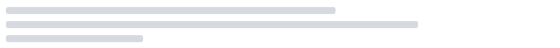

### Charts

**Bar Chart**  
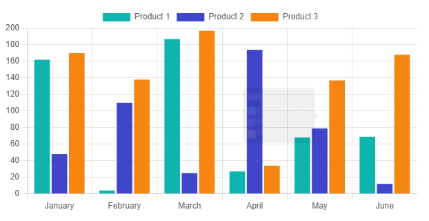

**Bubble Chart**  
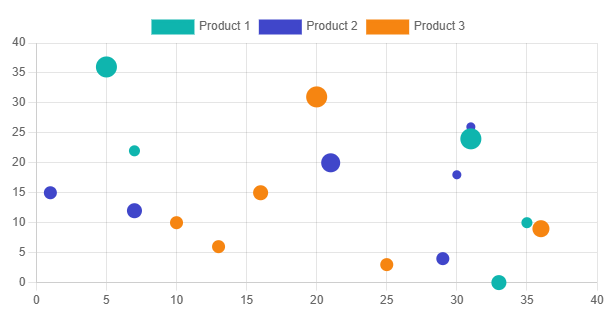

**Doughnut Chart**  
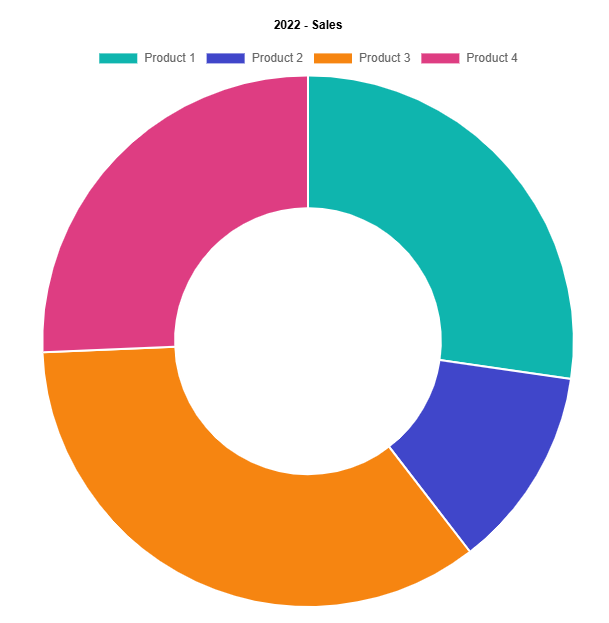

**Line Chart**  
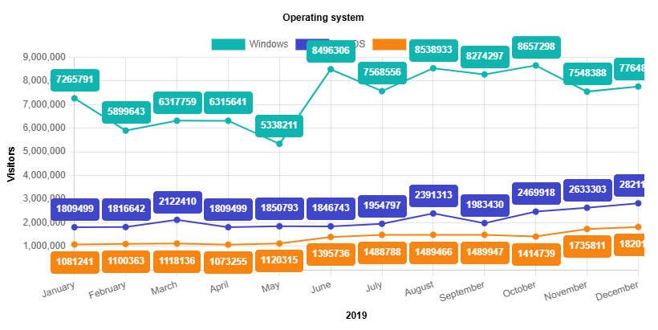

**Pie Chart**  
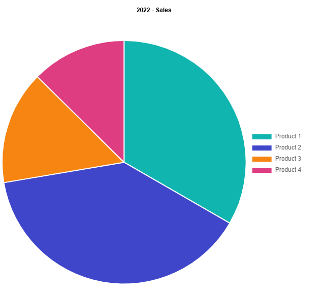

**PolarArea Chart**  
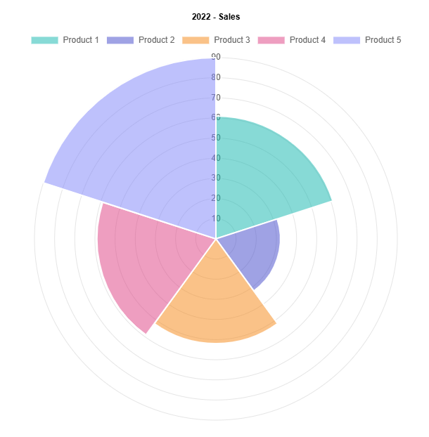

**Radar Chart**  
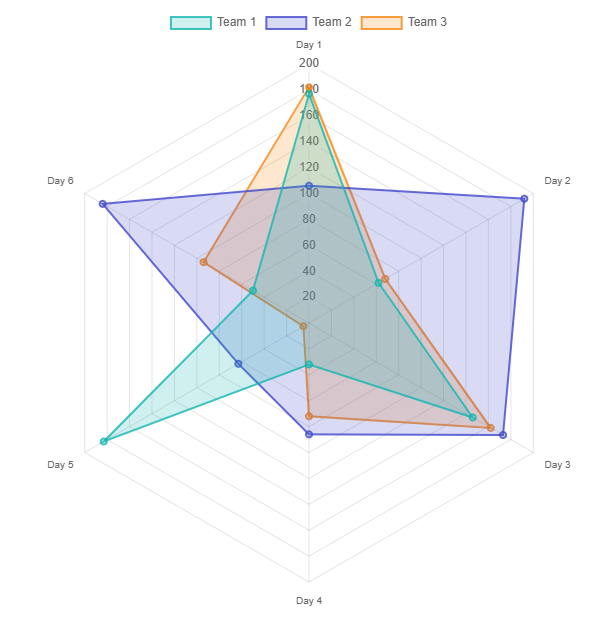

**Scatter Chart**  
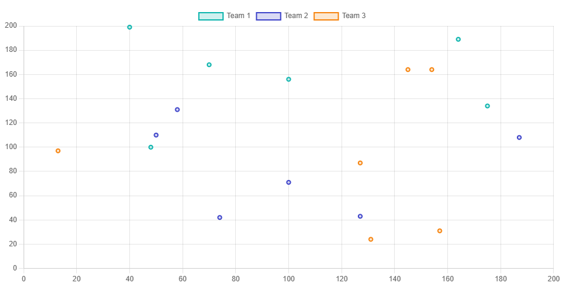

### Icons

**Bootstrap Icons**  
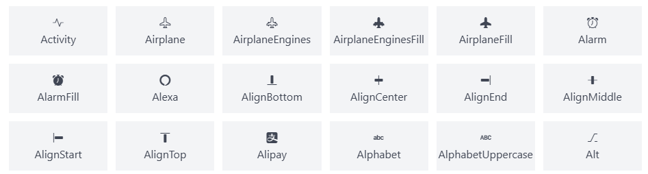

**Google Font Icons**  
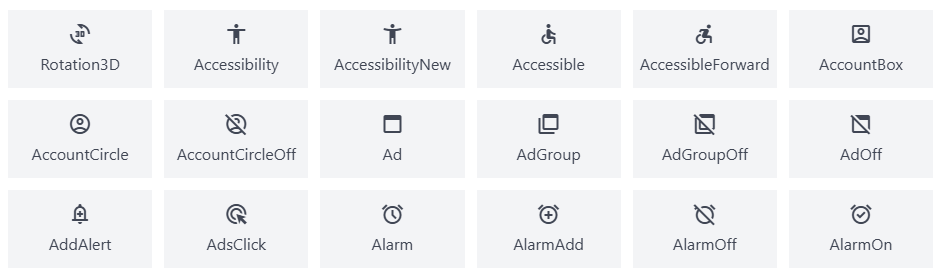

### Elements

**Block**  
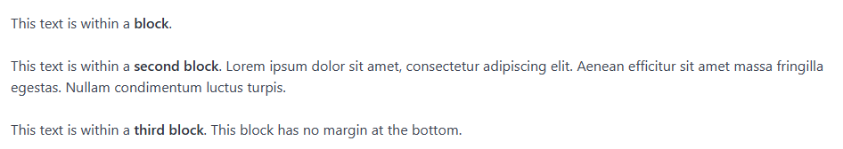

**Box**  
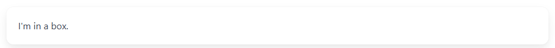

**Button**  
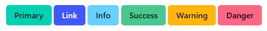

**Delete Button**  

**Image**  
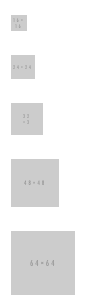

**Notification**  
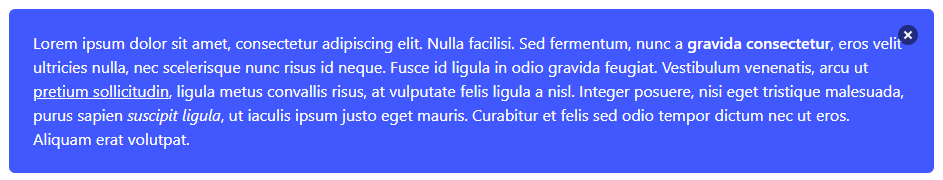

**Progress Bar**  
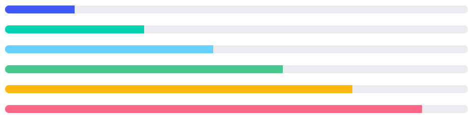

**Spinner**  
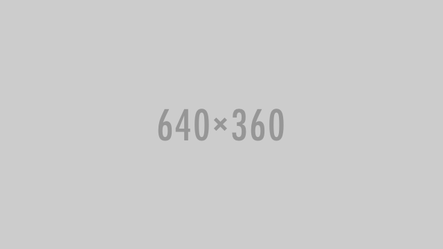

**Tags**  
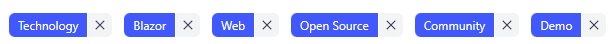

### Form

**Checkbox List Input**  

**Checkbox Input**  

**Date Input**  
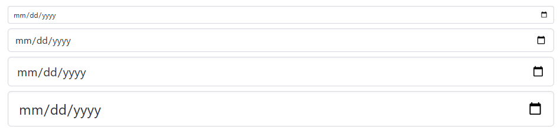

**Enum Input**  
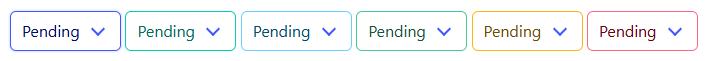

**Number Input**  
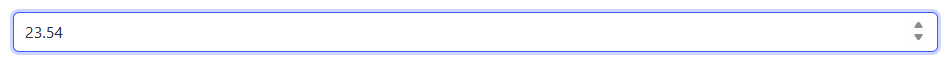

**OTP Input**  
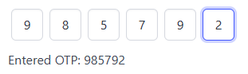

**Radio Input**  

**Radio List Input**  

**Select Input**  

**Text Area Input**  

**Text Input**  
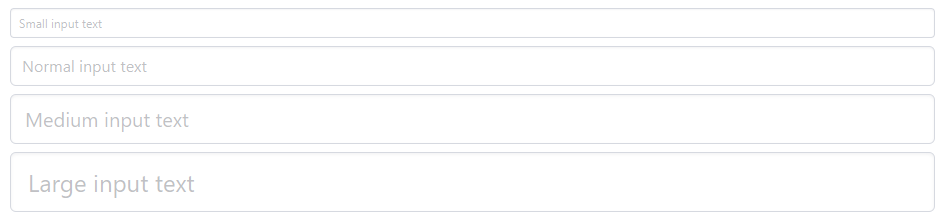

### Components

**Breadcrumb**  
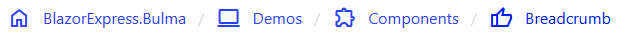

**Card**  

**Confirm Dialog**  
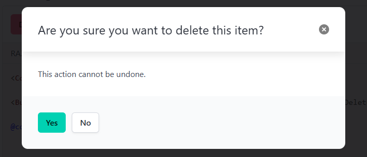

**Dropdown**  
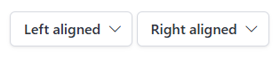

**Google Maps**  
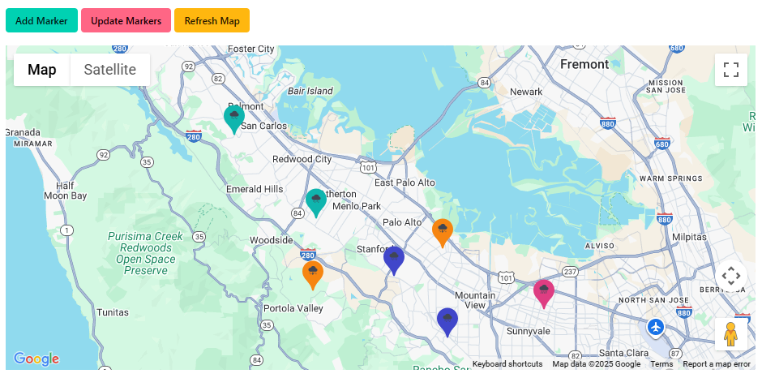

**Grid**  
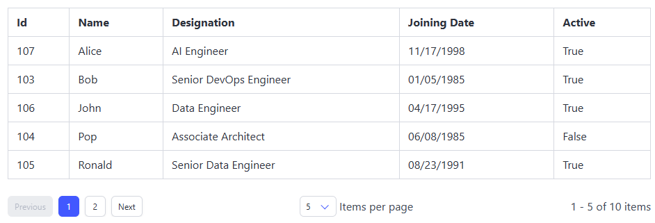

**Menu**  

**Message**  
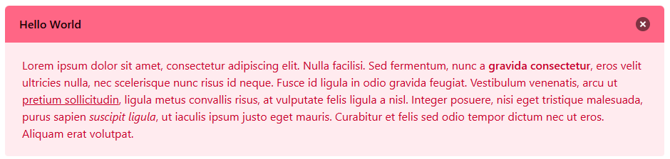

**Modal**  
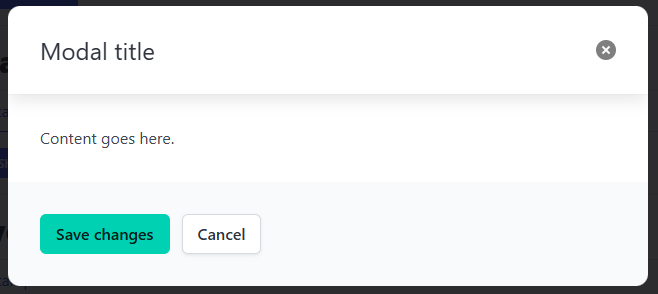

**Navbar**  
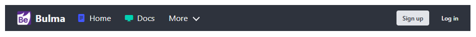

**Pagination**  
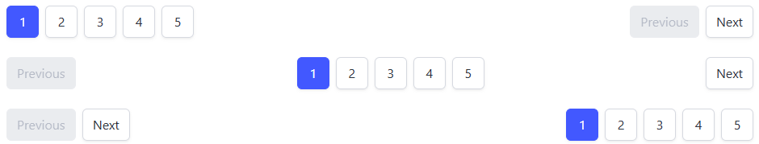

**Panel**  

**Pdf Viewer**  
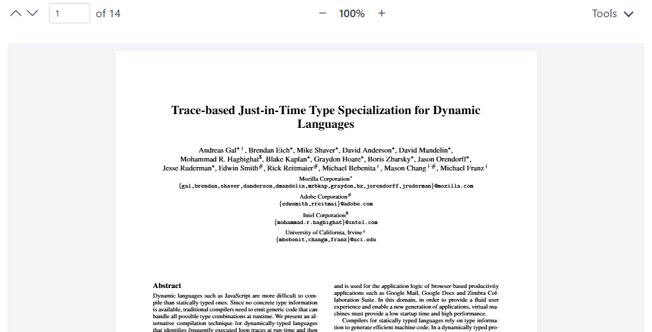

**Script Loader**  
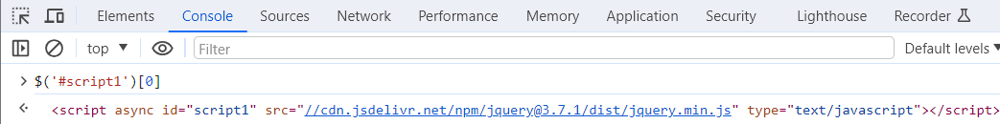

**Tabs**  
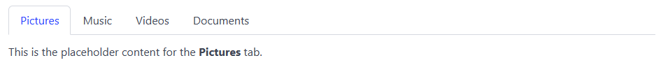

### Layout

**Hero**  
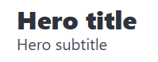

**SplitView**  

## Copyright and license

Code and documentation copyright 2025 [Blazor Express](https://bulma.blazorexpress.com/docs/). 
Code released under the [Apache-2.0 License](https://github.com/BlazorExpress/BlazorExpress.Bulma/blob/main/LICENSE).
